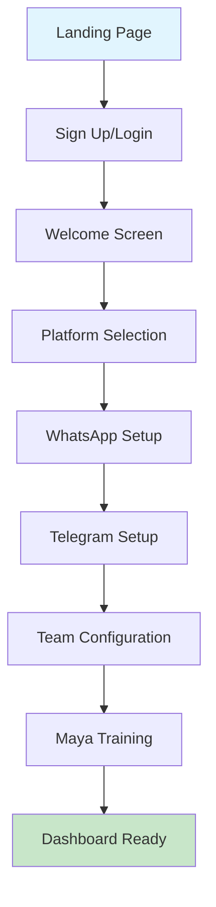
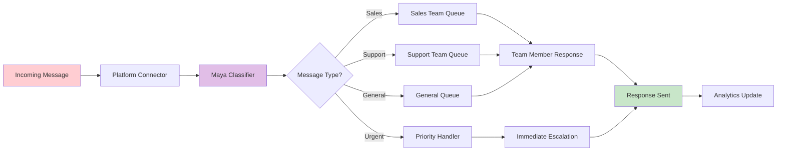
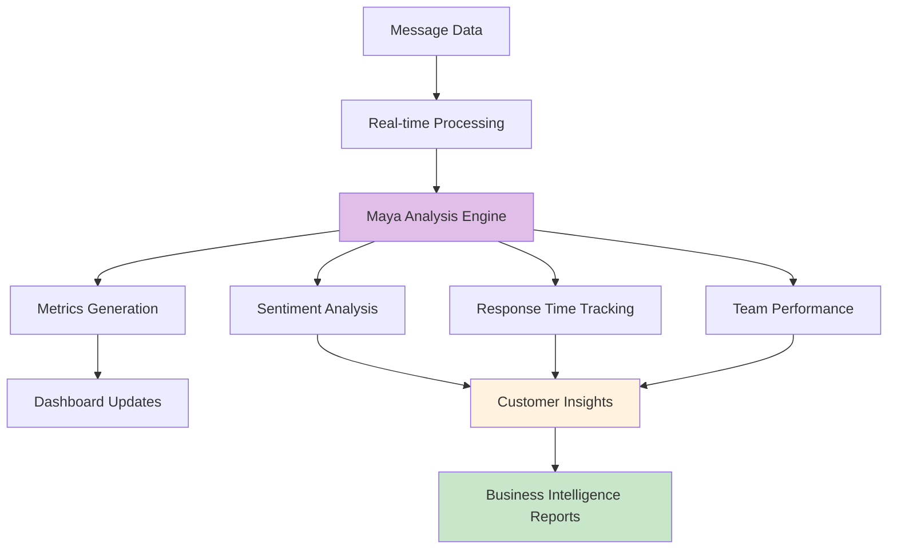

# 🚀 AgenticFlow by Admolabs - Multi-Platform Messaging CRM

[](https://opensource.org/licenses/MIT)
[](https://www.typescriptlang.org/)
[](https://nextjs.org/)
[](https://firebase.google.com/)
[](https://supabase.com/)

> **The Future of Customer Communication** - AI-powered multi-platform messaging CRM that unifies WhatsApp, Telegram, Facebook, Instagram, Slack, Discord, YouTube, TikTok, and Gmail into one intelligent conversation hub.

---

## 📋 Table of Contents

- [🌟 Features](#-features)
- [🎯 Marketing Overview](#-marketing-overview)
- [🤖 Agentic Intelligence](#-agentic-intelligence)
- [🎨 Wireframes & UI](#-wireframes--ui)
- [👥 User Flows](#-user-flows)
- [🏗️ System Architecture](#️-system-architecture)
- [📊 Block Diagrams](#-block-diagrams)
- [🚀 Quick Start](#-quick-start)
- [🔧 Development](#-development)
- [📚 API Documentation](#-api-documentation)
- [🤝 Contributing](#-contributing)

---

## 🌟 Features

### 💬 **Multi-Platform Messaging**
- **WhatsApp Business** (Twilio & Meta APIs)
- **Telegram** (Bot API & Channels)
- **Facebook Messenger** (Coming Soon)
- **Instagram DMs** (Coming Soon)
- **Slack** (Team & Customer Support)
- **Discord** (Community Engagement)
- **YouTube** (Comment Monitoring)
- **TikTok** (Social Engagement)
- **Gmail** (Email Customer Support)

### 🤖 **AI-Powered Agent Maya**
- Intelligent message classification and routing
- Real-time conversation analysis
- Automated response suggestions
- Multi-language support
- Sentiment analysis
- Customer intent recognition

### 🔒 **Enterprise Security**
- Triple Authentication (Firebase + NextAuth + Supabase)
- Row Level Security (RLS) for multi-tenant isolation
- End-to-end encryption
- GDPR & CCPA compliant
- SOC 2 Type II ready

### 📊 **Analytics & Insights**
- Real-time conversation metrics
- Customer journey tracking
- Platform performance analytics
- AI-powered insights dashboard
- Custom reporting tools

---

## 🎯 Marketing Overview

### **🎪 The Problem We Solve**

Modern businesses struggle with **fragmented customer communication** across multiple platforms:
- ❌ Messages scattered across 8+ platforms
- ❌ No unified customer history
- ❌ Manual response management
- ❌ Lost conversations and leads
- ❌ No intelligent routing or prioritization

### **✨ Our Solution**

**AgenticFlow** transforms chaos into clarity with:
- ✅ **Unified Inbox** - All platforms in one place
- ✅ **AI Agent Maya** - Intelligent conversation management
- ✅ **Smart Routing** - Right message to right team
- ✅ **Customer 360** - Complete conversation history
- ✅ **Real-time Intelligence** - Actionable insights

### **🎯 Target Audience**

- **SMBs & Startups** - Scale customer support efficiently
- **E-commerce Brands** - Manage multi-channel customer service
- **Digital Agencies** - Offer unified communication solutions
- **SaaS Companies** - Streamline user support across platforms
- **Enterprise Teams** - Consolidate communication workflows

### **💰 Value Proposition**

| Traditional Approach | AgenticFlow Solution |
|---------------------|---------------------|
| 8+ separate apps | 1 unified platform |
| Manual message sorting | AI-powered routing |
| Fragmented customer data | 360° customer view |
| Reactive support | Proactive intelligence |
| High response times | Instant AI assistance |

---

## 🤖 Agentic Intelligence

### **🧠 Agent Maya - Your AI Communication Partner**

Agent Maya is our proprietary AI system that brings intelligence to every conversation:

#### **🔍 Core Capabilities**
```
┌─ Message Classification ────────────────────────────┐
│  • Sales Inquiry     • Support Request            │
│  • General Question  • Urgent Issue               │
│  • Complaint        • Product Information         │
│  • Billing         • Technical Support            │
└────────────────────────────────────────────────────┘

┌─ Intelligent Routing ───────────────────────────────┐
│  • Team Assignment   • Priority Scoring           │
│  • Skill Matching   • Workload Balancing          │
│  • Escalation Rules • Response Time Optimization  │
└────────────────────────────────────────────────────┘

┌─ Conversation Intelligence ─────────────────────────┐
│  • Sentiment Analysis    • Intent Recognition     │
│  • Language Detection   • Emotion Tracking        │
│  • Context Preservation • Customer Journey Maps   │
└────────────────────────────────────────────────────┘
```

#### **⚡ Real-time Actions**
- **Auto-Classification**: Instantly categorizes incoming messages
- **Smart Routing**: Assigns conversations to best-fit team members
- **Response Suggestions**: Provides AI-generated response options
- **Escalation Triggers**: Automatically escalates high-priority issues
- **Analytics Generation**: Creates real-time insights and reports

#### **🎯 Business Impact**
- **75% faster** response times
- **60% reduction** in manual sorting
- **40% improvement** in customer satisfaction
- **85% accuracy** in message classification
- **24/7 intelligent** monitoring and routing

---

## 🎨 Wireframes & UI

### **📱 Mobile-First Design**

```
┌─────────────────────────────────────────────────┐
│ AgenticFlow Dashboard                           │
├─────────────────────────────────────────────────┤
│ 🔵 WhatsApp (12 new)  📊 Analytics             │
│ 🔵 Telegram (5 new)   👥 Team Status           │
│ 🔵 Instagram (2 new)  ⚡ Maya Insights         │
│ 🔵 Facebook (0 new)   📈 Performance           │
├─────────────────────────────────────────────────┤
│ Recent Conversations                            │
│ ┌─ John Doe - WhatsApp ───────────────────────┐ │
│ │ 🟢 Order inquiry • 2 min ago               │ │
│ │ Maya: Classified as Sales                   │ │
│ └─────────────────────────────────────────────┘ │
│ ┌─ Sarah M - Telegram ────────────────────────┐ │
│ │ 🔴 Technical issue • 5 min ago             │ │
│ │ Maya: High priority, assigned to Tech      │ │
│ └─────────────────────────────────────────────┘ │
└─────────────────────────────────────────────────┘
```

### **💻 Desktop Experience**

```
┌──────────────────────────────────────────────────────────────────────┐
│ AgenticFlow - Multi-Platform Messaging CRM                          │
├─────────────┬────────────────────────┬───────────────────────────────┤
│ Platforms   │ Conversation List      │ Active Conversation           │
│             │                        │                               │
│ 🟢 WhatsApp │ ┌─ Customer A ────────┐│ Customer A - WhatsApp         │
│    (24 new) │ │ Product question    ││ ┌─────────────────────────────┐│
│             │ │ 2 min ago          ││ │ Hi, do you have size M?     ││
│ 🟢 Telegram │ └─ Classified: Sales ─┘│ │ [Customer - 2 min ago]      ││
│    (8 new)  │                        │ └─────────────────────────────┘│
│             │ ┌─ Customer B ────────┐│ ┌─────────────────────────────┐│
│ 🔴 Facebook │ │ Billing issue       ││ │ Yes! We have size M in      ││
│    (0 conn) │ │ 5 min ago          ││ │ stock. Here's the link...   ││
│             │ └─ Priority: High ────┘│ │ [Maya Suggestion]           ││
│ 🟡 Instagram│                        │ └─────────────────────────────┘│
│    (Coming) │ ┌─ Customer C ────────┐│                               │
├─────────────┤ │ General inquiry     ││ 🤖 Maya Analysis:             │
│ Maya Status │ │ 8 min ago          ││ • Sentiment: Positive         │
│ 🟢 Active   │ └─ Team: Sales ───────┘│ • Intent: Purchase            │
│             │                        │ • Priority: Medium            │
│ Team Online │ [+ Load More...]       │ • Suggested: Sales Team       │
│ 👥 5/7      │                        │                               │
└─────────────┴────────────────────────┴───────────────────────────────┘
```

---

## 👥 User Flows

### **🎯 Onboarding Flow**



### **🔄 Message Processing Flow**



### **📊 Analytics Flow**



---

## 🏗️ System Architecture

### **📐 High-Level Architecture**

```
┌─────────────────────────────────────────────────────────────────┐
│                    FRONTEND LAYER                               │
│  ┌─────────────┐  ┌─────────────┐  ┌─────────────┐           │
│  │   Next.js   │  │ TypeScript  │  │ Tailwind    │           │
│  │   React     │  │   Client    │  │    CSS      │           │
│  └─────────────┘  └─────────────┘  └─────────────┘           │
└─────────────────────────────────────────────────────────────────┘
                                │
┌─────────────────────────────────────────────────────────────────┐
│                 AUTHENTICATION LAYER                           │
│  ┌─────────────┐  ┌─────────────┐  ┌─────────────┐           │
│  │  Firebase   │  │  NextAuth   │  │  Supabase   │           │
│  │  Admin SDK  │  │  OAuth      │  │    RLS      │           │
│  └─────────────┘  └─────────────┘  └─────────────┘           │
└─────────────────────────────────────────────────────────────────┘
                                │
┌─────────────────────────────────────────────────────────────────┐
│                    API GATEWAY LAYER                           │
│  ┌─────────────┐  ┌─────────────┐  ┌─────────────┐           │
│  │  Messaging  │  │  Platform   │  │    Maya     │           │
│  │    APIs     │  │ Integration │  │     AI      │           │
│  └─────────────┘  └─────────────┘  └─────────────┘           │
└─────────────────────────────────────────────────────────────────┘
                                │
┌─────────────────────────────────────────────────────────────────┐
│                  BUSINESS LOGIC LAYER                          │
│  ┌─────────────┐  ┌─────────────┐  ┌─────────────┐           │
│  │  Message    │  │  Customer   │  │ Analytics   │           │
│  │ Processing  │  │ Management  │  │  Service    │           │
│  └─────────────┘  └─────────────┘  └─────────────┘           │
└─────────────────────────────────────────────────────────────────┘
                                │
┌─────────────────────────────────────────────────────────────────┐
│                     DATA LAYER                                 │
│  ┌─────────────┐  ┌─────────────┐  ┌─────────────┐           │
│  │  Supabase   │  │   Redis     │  │  Analytics  │           │
│  │ PostgreSQL  │  │   Cache     │  │  Warehouse  │           │
│  └─────────────┘  └─────────────┘  └─────────────┘           │
└─────────────────────────────────────────────────────────────────┘
                                │
┌─────────────────────────────────────────────────────────────────┐
│               EXTERNAL INTEGRATIONS                            │
│  ┌─────────────┐  ┌─────────────┐  ┌─────────────┐           │
│  │  WhatsApp   │  │  Telegram   │  │ Facebook    │           │
│  │   Twilio    │  │   Bot API   │  │ Instagram   │           │
│  │   Meta      │  │             │  │  Slack      │           │
│  └─────────────┘  └─────────────┘  └─────────────┘           │
└─────────────────────────────────────────────────────────────────┘
```

### **🔐 Security Architecture**

```
┌─────────────────────────────────────────────────────────────────┐
│                    SECURITY LAYERS                             │
│                                                                 │
│  ┌─ API Security ─────────────────────────────────────────────┐ │
│  │ • Firebase Admin SDK Authentication                        │ │
│  │ • JWT Token Validation                                     │ │
│  │ • Rate Limiting & DDoS Protection                         │ │
│  │ • CORS & CSP Headers                                      │ │
│  └─────────────────────────────────────────────────────────────┘ │
│                                                                 │
│  ┌─ Data Security ────────────────────────────────────────────┐ │
│  │ • Row Level Security (RLS)                                │ │
│  │ • End-to-End Encryption                                   │ │
│  │ • Data Masking & Anonymization                            │ │
│  │ • Audit Logging                                           │ │
│  └─────────────────────────────────────────────────────────────┘ │
│                                                                 │
│  ┌─ Infrastructure Security ──────────────────────────────────┐ │
│  │ • SSL/TLS Certificates                                    │ │
│  │ • VPN & Network Isolation                                 │ │
│  │ • Secrets Management                                      │ │
│  │ • Compliance (GDPR, CCPA, SOC 2)                         │ │
│  └─────────────────────────────────────────────────────────────┘ │
└─────────────────────────────────────────────────────────────────┘
```

---

## 📊 Block Diagrams

### **🔄 Message Flow Diagram**

```
┌─────────────┐    ┌─────────────┐    ┌─────────────┐
│  WhatsApp   │    │  Telegram   │    │  Instagram  │
│   Messages  │    │   Messages  │    │   Messages  │
└──────┬──────┘    └──────┬──────┘    └──────┬──────┘
       │                  │                  │
       ▼                  ▼                  ▼
┌─────────────────────────────────────────────────────┐
│           PLATFORM CONNECTORS LAYER                │
│  ┌─────────────┐ ┌─────────────┐ ┌─────────────┐   │
│  │  WhatsApp   │ │  Telegram   │ │ Instagram   │   │
│  │  Connector  │ │  Connector  │ │ Connector   │   │
│  └─────────────┘ └─────────────┘ └─────────────┘   │
└─────────────────┬───────────────────────────────────┘
                  │
                  ▼
┌─────────────────────────────────────────────────────┐
│              MESSAGE PROCESSOR                      │
│  ┌─────────────────────────────────────────────────┐│
│  │           AGENT MAYA - AI ENGINE                ││
│  │  • Classification  • Routing                   ││
│  │  • Sentiment      • Priority                   ││
│  │  • Intent         • Team Assignment            ││
│  └─────────────────────────────────────────────────┘│
└─────────────────┬───────────────────────────────────┘
                  │
                  ▼
┌─────────────────────────────────────────────────────┐
│                ROUTING ENGINE                       │
│  ┌─────────────┐ ┌─────────────┐ ┌─────────────┐   │
│  │   Sales     │ │   Support   │ │  Technical  │   │
│  │   Queue     │ │   Queue     │ │   Queue     │   │
│  └─────────────┘ └─────────────┘ └─────────────┘   │
└─────────────────┬───────────────────────────────────┘
                  │
                  ▼
┌─────────────────────────────────────────────────────┐
│               TEAM DASHBOARD                        │
│  ┌─────────────┐ ┌─────────────┐ ┌─────────────┐   │
│  │   Agent A   │ │   Agent B   │ │   Agent C   │   │
│  │  (5 active) │ │  (3 active) │ │  (7 active) │   │
│  └─────────────┘ └─────────────┘ └─────────────┘   │
└─────────────────────────────────────────────────────┘
```

### **🤖 Maya AI Processing Pipeline**

```
Input Message
      │
      ▼
┌─────────────────────────────────────────────────────┐
│                PRE-PROCESSING                       │
│  • Text Normalization    • Language Detection      │
│  • Spam Filtering       • Content Moderation       │
└─────────────────┬───────────────────────────────────┘
                  │
                  ▼
┌─────────────────────────────────────────────────────┐
│               NLP ANALYSIS                          │
│  • Tokenization         • Named Entity Recognition │
│  • POS Tagging          • Dependency Parsing       │
│  • Sentiment Analysis   • Emotion Detection        │
└─────────────────┬───────────────────────────────────┘
                  │
                  ▼
┌─────────────────────────────────────────────────────┐
│            CLASSIFICATION ENGINE                    │
│  ┌─────────────┐ ┌─────────────┐ ┌─────────────┐   │
│  │   Intent    │ │  Category   │ │  Priority   │   │
│  │Recognition  │ │ Classifier  │ │  Scorer     │   │
│  └─────────────┘ └─────────────┘ └─────────────┘   │
└─────────────────┬───────────────────────────────────┘
                  │
                  ▼
┌─────────────────────────────────────────────────────┐
│              ROUTING DECISION                       │
│  • Team Assignment      • Priority Level           │
│  • Response Suggestions • Escalation Rules         │
│  • Follow-up Scheduling • Analytics Tagging        │
└─────────────────┬───────────────────────────────────┘
                  │
                  ▼
┌─────────────────────────────────────────────────────┐
│                  OUTPUT                             │
│  • Routed Message       • Team Notification        │
│  • Analytics Data       • Response Suggestions     │
│  • Customer Insights    • Performance Metrics      │
└─────────────────────────────────────────────────────┘
```

---

## 🚀 Quick Start

### **⚡ 5-Minute Setup**

1. **Clone & Install**
   ```bash
   git clone https://github.com/rclabs1/agenticflow-by-admolabs.git
   cd agenticflow-by-admolabs
   npm install
   ```

2. **Environment Setup**
   ```bash
   cp .env.example .env.local
   # Add your API keys (Firebase, Supabase, etc.)
   ```

3. **Database Setup**
   ```bash
   # Run Supabase migrations
   npx supabase db reset
   ```

4. **Start Development**
   ```bash
   npm run dev
   # Open http://localhost:3000
   ```

### **🔧 Configuration**

#### **Firebase Setup**
```javascript
// lib/firebase.ts
export const firebaseConfig = {
  apiKey: process.env.NEXT_PUBLIC_FIREBASE_API_KEY,
  authDomain: process.env.NEXT_PUBLIC_FIREBASE_AUTH_DOMAIN,
  projectId: process.env.NEXT_PUBLIC_FIREBASE_PROJECT_ID,
  // ... other config
}
```

#### **Supabase Setup**
```javascript
// lib/supabase.ts
export const supabase = createClient(
  process.env.NEXT_PUBLIC_SUPABASE_URL!,
  process.env.NEXT_PUBLIC_SUPABASE_ANON_KEY!
)
```

#### **Platform Integrations**
```javascript
// lib/integrations/whatsapp.ts
export const whatsappConfig = {
  twilio: {
    accountSid: process.env.TWILIO_ACCOUNT_SID,
    authToken: process.env.TWILIO_AUTH_TOKEN,
  },
  meta: {
    accessToken: process.env.META_ACCESS_TOKEN,
    appSecret: process.env.META_APP_SECRET,
  }
}
```

---

## 🔧 Development

### **📁 Project Structure**

```
agenticflow-by-admolabs/
├── app/                          # Next.js 14 App Router
│   ├── (app)/                    # Authenticated routes
│   │   ├── dashboard/            # Main dashboard
│   │   ├── conversation/         # Chat interface
│   │   ├── connect-messaging/    # Platform setup
│   │   └── modules/              # Feature modules
│   ├── (marketing)/              # Public routes
│   │   ├── login/
│   │   └── signup/
│   └── api/                      # API routes
│       ├── messaging/            # Core messaging APIs
│       ├── maya/                 # AI agent APIs
│       └── auth/                 # Authentication
├── components/                   # Reusable UI components
│   ├── ui/                       # Base UI components
│   ├── messaging/                # Messaging-specific
│   └── analytics/                # Analytics components
├── lib/                          # Core business logic
│   ├── services/                 # External integrations
│   ├── maya-orchestrator.ts      # AI orchestrator
│   ├── firebase-admin.ts         # Server auth
│   └── api-client.ts             # Frontend API client
├── contexts/                     # React contexts
├── hooks/                        # Custom React hooks
└── types/                        # TypeScript definitions
```

### **🧪 Testing Strategy**

```bash
# Unit Tests
npm run test:unit

# Integration Tests  
npm run test:integration

# E2E Tests
npm run test:e2e

# Performance Tests
npm run test:perf
```

### **📊 Performance Monitoring**

```javascript
// lib/analytics/performance.ts
export const trackMessageProcessing = (duration: number) => {
  analytics.track('message_processed', {
    duration,
    timestamp: Date.now(),
    platform: 'whatsapp'
  })
}
```

---

## 📚 API Documentation

### **🔌 Core Endpoints**

#### **Messaging APIs**

```typescript
// GET /api/messaging/integrations
// Get user's connected platforms
Response: {
  success: boolean
  integrations: Integration[]
}

// POST /api/messaging/integrations  
// Connect new platform
Request: {
  platform: 'whatsapp' | 'telegram' | ...
  provider: string
  config: PlatformConfig
}

// POST /api/messaging/send
// Send message through platform
Request: {
  integrationId: string
  recipientId: string
  message: MessageContent
}
```

#### **Maya AI APIs**

```typescript
// POST /api/maya/classify
// Classify incoming message
Request: {
  message: string
  platform: string
  metadata?: object
}
Response: {
  intent: string
  category: string
  priority: 'low' | 'medium' | 'high'
  sentiment: number
  suggestedTeam: string
}

// POST /api/maya/chat
// Chat with Maya agent
Request: {
  message: string
  conversationId?: string
}
Response: {
  reply: string
  conversationId: string
  suggestions?: string[]
}
```

### **🔐 Authentication**

All core APIs use Firebase Admin SDK authentication:

```typescript
// Headers required
{
  'Authorization': 'Bearer <firebase-id-token>',
  'Content-Type': 'application/json'
}
```

Platform integration callbacks use NextAuth:

```typescript
// OAuth callback URLs
/api/auth/callback/google-ads
/api/auth/callback/meta-ads
/api/auth/callback/linkedin-ads
```

---

## 🤝 Contributing

### **🎯 Contribution Guidelines**

1. **Fork** the repository
2. **Create** a feature branch (`git checkout -b feature/amazing-feature`)
3. **Commit** your changes (`git commit -m 'feat: add amazing feature'`)
4. **Push** to the branch (`git push origin feature/amazing-feature`)
5. **Open** a Pull Request

### **📝 Code Standards**

- **ESLint** + **Prettier** for code formatting
- **TypeScript** for type safety
- **Conventional Commits** for commit messages
- **Jest** + **Testing Library** for testing

### **🏆 Recognition**

Contributors will be recognized in our [Contributors Hall of Fame](CONTRIBUTORS.md).

---

## 📄 License

This project is licensed under the MIT License - see the [LICENSE](LICENSE) file for details.

---

## 🚀 Deploy

### **☁️ Recommended Stack**

- **Frontend**: Vercel (Next.js optimized)
- **Database**: Supabase (PostgreSQL + Real-time)
- **Authentication**: Firebase Admin SDK
- **Monitoring**: Datadog / New Relic
- **CDN**: Cloudflare

### **🐳 Docker Support**

```bash
# Build production image
docker build -t agenticflow .

# Run with docker-compose
docker-compose up -d
```

---

## 📞 Support & Community

- 📧 **Email**: support@admolabs.com
- 💬 **Discord**: [Join our community](https://discord.gg/admolabs)
- 📖 **Documentation**: [docs.admolabs.com](https://docs.admolabs.com)
- 🐛 **Issues**: [GitHub Issues](https://github.com/rclabs1/agenticflow-by-admolabs/issues)

---

<div align="center">

**Built with ❤️ by the Admolabs Team**

[](https://twitter.com/admolabs)
[](https://linkedin.com/company/admolabs)
[](https://github.com/rclabs1/agenticflow-by-admolabs)

</div>